Activate the project and instantiate using the following code

```julia
using Pkg; Pkg.activate(".")
# uncomment the following to install all the required packages
# Pkg.instantiate()
```


load required packages

```julia
using Dates, DataFrames, CSV, JDF, Arrow, GLM, StatsBase, HypothesisTests
using PythonCall, MLJ, XGBoost, FLoops, Geocoder, CairoMakie # GLMakie
import StatsPlots as sp
import Plots as plt
```


+ Data cleaning.
- For ease of comparison across languages, make the column names consistent
  in style with lowercase using underscore to separate words within a name.


load data and rename columns

```julia
julia> @time dat = CSV.read("nyc311_011523-012123_by022023.csv", DataFrame,
                      dateformat="m/d/y H:M:S p")
  0.355489 seconds (1.61 M allocations: 115.699 MiB)
54469×41 DataFrame
   Row │ Unique Key  Created Date         Closed Date          Agency   Agency ⋯
       │ Int64       DateTime             DateTime?            String7  String ⋯
───────┼────────────────────────────────────────────────────────────────────────
     1 │   56532399  2023-01-15T00:00:00  2023-01-17T00:00:01  DOHMH    Depart ⋯
     2 │   56533302  2023-01-15T00:00:00  2023-01-23T00:00:01  DOHMH    Depart
     3 │   56533451  2023-01-15T00:00:00  2023-01-17T09:34:08  DOHMH    Depart
     4 │   56536021  2023-01-15T00:00:00  2023-01-17T09:48:19  DOHMH    Depart
     5 │   56538004  2023-01-15T00:00:00  2023-01-23T15:08:02  DOHMH    Depart ⋯
     6 │   56524984  2023-01-15T00:00:18  2023-01-15T02:37:30  NYPD     New Yo
     7 │   56526790  2023-01-15T00:00:21  2023-01-15T01:54:24  NYPD     New Yo
     8 │   56525034  2023-01-15T00:00:50  2023-01-15T01:09:56  NYPD     New Yo
   ⋮   │     ⋮                ⋮                    ⋮              ⋮            ⋱
 54463 │   56591186  2023-01-21T23:59:12  2023-01-22T06:41:47  NYPD     New Yo ⋯
 54464 │   56587053  2023-01-21T23:59:24  2023-01-22T06:24:40  NYPD     New Yo
 54465 │   56590382  2023-01-22T00:00:00  2023-01-22T04:29:17  NYPD     New Yo
 54466 │   56591502  2023-01-22T00:00:00  2023-01-23T10:03:08  DOHMH    Depart
 54467 │   56592422  2023-01-22T00:00:00  2023-01-23T10:05:39  DOHMH    Depart ⋯
 54468 │   56594948  2023-01-22T00:00:00  2023-02-01T00:00:01  DOHMH    Depart
 54469 │   56597360  2023-01-22T00:00:00  2023-01-23T10:02:46  DOHMH    Depart
                                               37 columns and 54454 rows omitted

julia> @time rename!(x -> lowercase(replace(x, " " => "_")), dat)
  0.034048 seconds (28.05 k allocations: 1.861 MiB)
54469×41 DataFrame
   Row │ unique_key  created_date         closed_date          agency   agency ⋯
       │ Int64       DateTime             DateTime?            String7  String ⋯
───────┼────────────────────────────────────────────────────────────────────────
     1 │   56532399  2023-01-15T00:00:00  2023-01-17T00:00:01  DOHMH    Depart ⋯
     2 │   56533302  2023-01-15T00:00:00  2023-01-23T00:00:01  DOHMH    Depart
     3 │   56533451  2023-01-15T00:00:00  2023-01-17T09:34:08  DOHMH    Depart
     4 │   56536021  2023-01-15T00:00:00  2023-01-17T09:48:19  DOHMH    Depart
     5 │   56538004  2023-01-15T00:00:00  2023-01-23T15:08:02  DOHMH    Depart ⋯
     6 │   56524984  2023-01-15T00:00:18  2023-01-15T02:37:30  NYPD     New Yo
     7 │   56526790  2023-01-15T00:00:21  2023-01-15T01:54:24  NYPD     New Yo
     8 │   56525034  2023-01-15T00:00:50  2023-01-15T01:09:56  NYPD     New Yo
   ⋮   │     ⋮                ⋮                    ⋮              ⋮            ⋱
 54463 │   56591186  2023-01-21T23:59:12  2023-01-22T06:41:47  NYPD     New Yo ⋯
 54464 │   56587053  2023-01-21T23:59:24  2023-01-22T06:24:40  NYPD     New Yo
 54465 │   56590382  2023-01-22T00:00:00  2023-01-22T04:29:17  NYPD     New Yo
 54466 │   56591502  2023-01-22T00:00:00  2023-01-23T10:03:08  DOHMH    Depart
 54467 │   56592422  2023-01-22T00:00:00  2023-01-23T10:05:39  DOHMH    Depart ⋯
 54468 │   56594948  2023-01-22T00:00:00  2023-02-01T00:00:01  DOHMH    Depart
 54469 │   56597360  2023-01-22T00:00:00  2023-01-23T10:02:46  DOHMH    Depart
                                               37 columns and 54454 rows omitted
```


Save and load the data with other formats 

```julia
# @time Arrow.write("nyc311.arrow", dat)
@time dat = Arrow.Table("nyc311.arrow") |> DataFrame
@time dat = copy(dat)

# @time JDF.save("nyc311.jdf", dat)
@time dat = JDF.load("nyc311.jdf") |> DataFrame
```


- Check for obvious errors or inefficiencies. For example, are there records
  whose Closed Date is earlier than or exactly the same as the Created
  Date? Are their invalid values for any columns? Are any columns redundant?

```julia
julia> first(dat, 5)
5×41 DataFrame
 Row │ unique_key  created_date         closed_date          agency   agency_n ⋯
     │ Int64       DateTime             DateTime?            String7  String   ⋯
─────┼──────────────────────────────────────────────────────────────────────────
   1 │   56532399  2023-01-15T00:00:00  2023-01-17T00:00:01  DOHMH    Departme ⋯
   2 │   56533302  2023-01-15T00:00:00  2023-01-23T00:00:01  DOHMH    Departme
   3 │   56533451  2023-01-15T00:00:00  2023-01-17T09:34:08  DOHMH    Departme
   4 │   56536021  2023-01-15T00:00:00  2023-01-17T09:48:19  DOHMH    Departme
   5 │   56538004  2023-01-15T00:00:00  2023-01-23T15:08:02  DOHMH    Departme ⋯
                                                              37 columns omitted

julia> last(dat, 5)
5×41 DataFrame
 Row │ unique_key  created_date         closed_date          agency   agency_n ⋯
     │ Int64       DateTime             DateTime?            String7  String   ⋯
─────┼──────────────────────────────────────────────────────────────────────────
   1 │   56590382  2023-01-22T00:00:00  2023-01-22T04:29:17  NYPD     New York ⋯
   2 │   56591502  2023-01-22T00:00:00  2023-01-23T10:03:08  DOHMH    Departme
   3 │   56592422  2023-01-22T00:00:00  2023-01-23T10:05:39  DOHMH    Departme
   4 │   56594948  2023-01-22T00:00:00  2023-02-01T00:00:01  DOHMH    Departme
   5 │   56597360  2023-01-22T00:00:00  2023-01-23T10:02:46  DOHMH    Departme ⋯
                                                              37 columns omitted

julia> n, p = size(dat)
(54469, 41)

julia> ds = describe(dat)
41×7 DataFrame
 Row │ variable                  mean       min                                ⋯
     │ Symbol                    Union…     Any                                ⋯
─────┼──────────────────────────────────────────────────────────────────────────
   1 │ unique_key                5.65614e7  56524167                           ⋯
   2 │ created_date                         2023-01-15T00:00:00
   3 │ closed_date                          2022-01-12T10:06:00
   4 │ agency                               DCA
   5 │ agency_name                          Department of Buildings            ⋯
   6 │ complaint_type                       AHV Inspection Unit
   7 │ descriptor                           1 or 2
   8 │ location_type                        1-2 Family Dwelling
  ⋮  │            ⋮                  ⋮                      ⋮                  ⋱
  35 │ bridge_highway_name                  1                                  ⋯
  36 │ bridge_highway_direction             1 2 3 Downtown & Brooklyn
  37 │ road_ramp                            10 St & 4 Av NW corner
  38 │ bridge_highway_segment               14th Ave Bay 8 St (Exit 4) - Bay…
  39 │ latitude                  40.7367    40.4989                            ⋯
  40 │ longitude                 -73.9248   -74.2525
  41 │ location                             (40.498948846168354, -74.2443650…
                                                   4 columns and 26 rows omitted

julia> ds[!, [:variable, :nmissing]] # ds[!, [1, 6]]
41×2 DataFrame
 Row │ variable                  nmissing
     │ Symbol                    Int64
─────┼────────────────────────────────────
   1 │ unique_key                       0
   2 │ created_date                     0
   3 │ closed_date                   5176
   4 │ agency                           0
   5 │ agency_name                      0
   6 │ complaint_type                   0
   7 │ descriptor                     394
   8 │ location_type                 7386
  ⋮  │            ⋮                 ⋮
  35 │ bridge_highway_name          54126
  36 │ bridge_highway_direction     54290
  37 │ road_ramp                    54334
  38 │ bridge_highway_segment       54126
  39 │ latitude                       978
  40 │ longitude                      978
  41 │ location                       978
                           26 rows omitted

julia> ds.mis_rate .= ds.nmissing ./ n
41-element Vector{Float64}:
 0.0
 0.0
 0.0950265288512732
 0.0
 0.0
 0.0
 0.007233472250270797
 0.13560006609263986
 0.013750940902164534
 0.04743982815913639
 ⋮
 0.9994492280012485
 0.989553691090345
 0.9937028401476069
 0.9967137270741155
 0.9975215260056178
 0.9937028401476069
 0.01795516715930162
 0.01795516715930162
 0.01795516715930162

julia> mis_pattern = ds[!, [:variable, :mis_rate]]
41×2 DataFrame
 Row │ variable                  mis_rate
     │ Symbol                    Float64
─────┼──────────────────────────────────────
   1 │ unique_key                0.0
   2 │ created_date              0.0
   3 │ closed_date               0.0950265
   4 │ agency                    0.0
   5 │ agency_name               0.0
   6 │ complaint_type            0.0
   7 │ descriptor                0.00723347
   8 │ location_type             0.1356
  ⋮  │            ⋮                  ⋮
  35 │ bridge_highway_name       0.993703
  36 │ bridge_highway_direction  0.996714
  37 │ road_ramp                 0.997522
  38 │ bridge_highway_segment    0.993703
  39 │ latitude                  0.0179552
  40 │ longitude                 0.0179552
  41 │ location                  0.0179552
                             26 rows omitted
```


agency v.s. agency_name, location is redundant with latitude and longitude ...

```julia
julia> dat1 = dat[!, [1:4; 6:10; 25:26; 39:40]]
54469×13 DataFrame
   Row │ unique_key  created_date         closed_date          agency   compla ⋯
       │ Int64       DateTime             DateTime?            String7  String ⋯
───────┼────────────────────────────────────────────────────────────────────────
     1 │   56532399  2023-01-15T00:00:00  2023-01-17T00:00:01  DOHMH    Food P ⋯
     2 │   56533302  2023-01-15T00:00:00  2023-01-23T00:00:01  DOHMH    Food P
     3 │   56533451  2023-01-15T00:00:00  2023-01-17T09:34:08  DOHMH    Food P
     4 │   56536021  2023-01-15T00:00:00  2023-01-17T09:48:19  DOHMH    Food P
     5 │   56538004  2023-01-15T00:00:00  2023-01-23T15:08:02  DOHMH    Food P ⋯
     6 │   56524984  2023-01-15T00:00:18  2023-01-15T02:37:30  NYPD     Noise
     7 │   56526790  2023-01-15T00:00:21  2023-01-15T01:54:24  NYPD     Noise
     8 │   56525034  2023-01-15T00:00:50  2023-01-15T01:09:56  NYPD     Illega
   ⋮   │     ⋮                ⋮                    ⋮              ⋮            ⋱
 54463 │   56591186  2023-01-21T23:59:12  2023-01-22T06:41:47  NYPD     Illega ⋯
 54464 │   56587053  2023-01-21T23:59:24  2023-01-22T06:24:40  NYPD     Noise
 54465 │   56590382  2023-01-22T00:00:00  2023-01-22T04:29:17  NYPD     Noise
 54466 │   56591502  2023-01-22T00:00:00  2023-01-23T10:03:08  DOHMH    Food P
 54467 │   56592422  2023-01-22T00:00:00  2023-01-23T10:05:39  DOHMH    Food P ⋯
 54468 │   56594948  2023-01-22T00:00:00  2023-02-01T00:00:01  DOHMH    Food P
 54469 │   56597360  2023-01-22T00:00:00  2023-01-23T10:02:46  DOHMH    Food P
                                                9 columns and 54454 rows omitted

julia> ds1 = describe(dat1)
13×7 DataFrame
 Row │ variable          mean       min                      median            ⋯
     │ Symbol            Union…     Any                      Any               ⋯
─────┼──────────────────────────────────────────────────────────────────────────
   1 │ unique_key        5.65614e7  56524167                 5.65613e7         ⋯
   2 │ created_date                 2023-01-15T00:00:00      2023-01-18T13:20:
   3 │ closed_date                  2022-01-12T10:06:00      2023-01-19T15:05:
   4 │ agency                       DCA
   5 │ complaint_type               AHV Inspection Unit                        ⋯
   6 │ descriptor                   1 or 2
   7 │ location_type                1-2 Family Dwelling
   8 │ incident_zip      10807.1    10000                    11201.0
   9 │ incident_address             -999 FURMANVILLE AVENUE                    ⋯
  10 │ bbl               2.6957e9   0                        3.01604e9
  11 │ borough                      BRONX
  12 │ latitude          40.7367    40.4989                  40.7309
  13 │ longitude         -73.9248   -74.2525                 -73.9281          ⋯
                                                               4 columns omitted

julia> dat2 = dat1[isless.(dat1.created_date, dat1.closed_date), :]
52576×13 DataFrame
   Row │ unique_key  created_date         closed_date          agency   compla ⋯
       │ Int64       DateTime             DateTime?            String7  String ⋯
───────┼────────────────────────────────────────────────────────────────────────
     1 │   56532399  2023-01-15T00:00:00  2023-01-17T00:00:01  DOHMH    Food P ⋯
     2 │   56533302  2023-01-15T00:00:00  2023-01-23T00:00:01  DOHMH    Food P
     3 │   56533451  2023-01-15T00:00:00  2023-01-17T09:34:08  DOHMH    Food P
     4 │   56536021  2023-01-15T00:00:00  2023-01-17T09:48:19  DOHMH    Food P
     5 │   56538004  2023-01-15T00:00:00  2023-01-23T15:08:02  DOHMH    Food P ⋯
     6 │   56524984  2023-01-15T00:00:18  2023-01-15T02:37:30  NYPD     Noise
     7 │   56526790  2023-01-15T00:00:21  2023-01-15T01:54:24  NYPD     Noise
     8 │   56525034  2023-01-15T00:00:50  2023-01-15T01:09:56  NYPD     Illega
   ⋮   │     ⋮                ⋮                    ⋮              ⋮            ⋱
 52570 │   56591186  2023-01-21T23:59:12  2023-01-22T06:41:47  NYPD     Illega ⋯
 52571 │   56587053  2023-01-21T23:59:24  2023-01-22T06:24:40  NYPD     Noise
 52572 │   56590382  2023-01-22T00:00:00  2023-01-22T04:29:17  NYPD     Noise
 52573 │   56591502  2023-01-22T00:00:00  2023-01-23T10:03:08  DOHMH    Food P
 52574 │   56592422  2023-01-22T00:00:00  2023-01-23T10:05:39  DOHMH    Food P ⋯
 52575 │   56594948  2023-01-22T00:00:00  2023-02-01T00:00:01  DOHMH    Food P
 52576 │   56597360  2023-01-22T00:00:00  2023-01-23T10:02:46  DOHMH    Food P
                                                9 columns and 52561 rows omitted
```


- Fill in missing values if possible. For example, if incident zip code is
  missing but the location is not, the zip code could be recovered by
  geocoding.

```julia
julia> idx = findall(ismissing.(dat2.latitude) .& .!ismissing.(dat2.incident_address))
518-element Vector{Int64}:
   539
  1254
  1286
  1337
  1427
  1476
  1526
  1633
  2046
  2065
     ⋮
 51561
 51721
 51758
 51811
 51816
 51824
 51942
 52051
 52082
```


Geocoder.jl can be used as a geocoding client for Google Maps API and Open Street Maps API. It requires an APT key to use, so the missing coordiantes are stored in the jdf format.

```julia
julia> include("get_coordinates.jl")
getCoordinates (generic function with 2 methods)

julia> coor = geocode("28-07 JACKSON AVENUE, New York", osm_key, "osm")
Dict{String, Any} with 2 entries:
  "lat" => 40.7484
  "lng" => -73.9388

julia> if abspath(PROGRAM_FILE) == @__FILE__ # only run as the main script
           coordinates = DataFrame([c => Float64[] for c in ["lat", "lng"]])
           ads = dat2.incident_address[idx]
           for a in ads
               g = geocode(a * " New York", osm_key, "osm")
               push!(coordinates, g)
           end
           # CSV.write("coordinates.csv", coordinates)
           # Arrow.write("coordinates.arrow", coordinates)
           JDF.save("coordinates.jdf", coordinates)
       else
           coordinates = JDF.load("coordinates.jdf") |> DataFrame
       end
518×2 DataFrame
 Row │ lat      lng
     │ Float64  Float64
─────┼───────────────────
   1 │ 40.8699  -73.8928
   2 │ 40.8012  -73.9598
   3 │ 40.8269  -73.872
   4 │ 40.6853  -73.8468
   5 │ 40.8674  -73.8359
   6 │ 40.758   -73.7894
   7 │ 40.7846  -73.8283
   8 │ 40.6347  -74.1158
  ⋮  │    ⋮        ⋮
 512 │ 40.636   -74.0013
 513 │ 40.7672  -73.9862
 514 │ 40.6273  -74.1102
 515 │ 40.7672  -73.9862
 516 │ 40.6675  -73.7537
 517 │ 40.7277  -73.8491
 518 │ 40.6019  -73.7458
         503 rows omitted

julia> rename!(coordinates, [:latitude, :longitude])
518×2 DataFrame
 Row │ latitude  longitude
     │ Float64   Float64
─────┼─────────────────────
   1 │  40.8699   -73.8928
   2 │  40.8012   -73.9598
   3 │  40.8269   -73.872
   4 │  40.6853   -73.8468
   5 │  40.8674   -73.8359
   6 │  40.758    -73.7894
   7 │  40.7846   -73.8283
   8 │  40.6347   -74.1158
  ⋮  │    ⋮          ⋮
 512 │  40.636    -74.0013
 513 │  40.7672   -73.9862
 514 │  40.6273   -74.1102
 515 │  40.7672   -73.9862
 516 │  40.6675   -73.7537
 517 │  40.7277   -73.8491
 518 │  40.6019   -73.7458
           503 rows omitted

julia> dat2[idx, [:latitude, :longitude]] .= coordinates
518×2 SubDataFrame
 Row │ latitude  longitude
     │ Float64?  Float64?
─────┼─────────────────────
   1 │  40.8699   -73.8928
   2 │  40.8012   -73.9598
   3 │  40.8269   -73.872
   4 │  40.6853   -73.8468
   5 │  40.8674   -73.8359
   6 │  40.758    -73.7894
   7 │  40.7846   -73.8283
   8 │  40.6347   -74.1158
  ⋮  │    ⋮          ⋮
 512 │  40.636    -74.0013
 513 │  40.7672   -73.9862
 514 │  40.6273   -74.1102
 515 │  40.7672   -73.9862
 516 │  40.6675   -73.7537
 517 │  40.7277   -73.8491
 518 │  40.6019   -73.7458
           503 rows omitted
```


- Summarize your suggestions to the data curator in several bullet points.


use a variable dictionary instead of additional columns


+ Data manipulation. Focus only on requests made to NYPD. 
- Create a a new variable `duration`, which represents the time period from
  the Created Date to Closed Date. Note that duration may be censored for
  some requests.

```julia
julia> dat3 = dat2[dat2.agency .== "NYPD", :]
21535×13 DataFrame
   Row │ unique_key  created_date         closed_date          agency   compla ⋯
       │ Int64       DateTime             DateTime?            String7  String ⋯
───────┼────────────────────────────────────────────────────────────────────────
     1 │   56524984  2023-01-15T00:00:18  2023-01-15T02:37:30  NYPD     Noise  ⋯
     2 │   56526790  2023-01-15T00:00:21  2023-01-15T01:54:24  NYPD     Noise
     3 │   56525034  2023-01-15T00:00:50  2023-01-15T01:09:56  NYPD     Illega
     4 │   56526234  2023-01-15T00:01:02  2023-01-15T05:47:41  NYPD     Noise
     5 │   56530817  2023-01-15T00:01:07  2023-01-15T01:01:26  NYPD     Noise  ⋯
     6 │   56530491  2023-01-15T00:01:12  2023-01-15T01:47:57  NYPD     Noise
     7 │   56527886  2023-01-15T00:01:22  2023-01-15T00:15:44  NYPD     Blocke
     8 │   56530623  2023-01-15T00:01:23  2023-01-15T01:07:30  NYPD     Illega
   ⋮   │     ⋮                ⋮                    ⋮              ⋮            ⋱
 21529 │   56588474  2023-01-21T23:58:36  2023-01-22T01:02:17  NYPD     Blocke ⋯
 21530 │   56590134  2023-01-21T23:58:43  2023-01-22T01:13:54  NYPD     Noise
 21531 │   56585700  2023-01-21T23:58:48  2023-01-22T01:30:36  NYPD     Noise
 21532 │   56588661  2023-01-21T23:59:10  2023-01-22T02:50:54  NYPD     Noise
 21533 │   56591186  2023-01-21T23:59:12  2023-01-22T06:41:47  NYPD     Illega ⋯
 21534 │   56587053  2023-01-21T23:59:24  2023-01-22T06:24:40  NYPD     Noise
 21535 │   56590382  2023-01-22T00:00:00  2023-01-22T04:29:17  NYPD     Noise
                                                9 columns and 21520 rows omitted

julia> describe(dat3)[!,[1, end-1]]
13×2 DataFrame
 Row │ variable          nmissing
     │ Symbol            Int64
─────┼────────────────────────────
   1 │ unique_key               0
   2 │ created_date             0
   3 │ closed_date              1
   4 │ agency                   0
   5 │ complaint_type           0
   6 │ descriptor               0
   7 │ location_type            0
   8 │ incident_zip           240
   9 │ incident_address       240
  10 │ bbl                   2010
  11 │ borough                  0
  12 │ latitude                46
  13 │ longitude               46

julia> filter!(:closed_date => !ismissing, dat3)
21534×13 DataFrame
   Row │ unique_key  created_date         closed_date          agency   compla ⋯
       │ Int64       DateTime             DateTime?            String7  String ⋯
───────┼────────────────────────────────────────────────────────────────────────
     1 │   56524984  2023-01-15T00:00:18  2023-01-15T02:37:30  NYPD     Noise  ⋯
     2 │   56526790  2023-01-15T00:00:21  2023-01-15T01:54:24  NYPD     Noise
     3 │   56525034  2023-01-15T00:00:50  2023-01-15T01:09:56  NYPD     Illega
     4 │   56526234  2023-01-15T00:01:02  2023-01-15T05:47:41  NYPD     Noise
     5 │   56530817  2023-01-15T00:01:07  2023-01-15T01:01:26  NYPD     Noise  ⋯
     6 │   56530491  2023-01-15T00:01:12  2023-01-15T01:47:57  NYPD     Noise
     7 │   56527886  2023-01-15T00:01:22  2023-01-15T00:15:44  NYPD     Blocke
     8 │   56530623  2023-01-15T00:01:23  2023-01-15T01:07:30  NYPD     Illega
   ⋮   │     ⋮                ⋮                    ⋮              ⋮            ⋱
 21528 │   56588474  2023-01-21T23:58:36  2023-01-22T01:02:17  NYPD     Blocke ⋯
 21529 │   56590134  2023-01-21T23:58:43  2023-01-22T01:13:54  NYPD     Noise
 21530 │   56585700  2023-01-21T23:58:48  2023-01-22T01:30:36  NYPD     Noise
 21531 │   56588661  2023-01-21T23:59:10  2023-01-22T02:50:54  NYPD     Noise
 21532 │   56591186  2023-01-21T23:59:12  2023-01-22T06:41:47  NYPD     Illega ⋯
 21533 │   56587053  2023-01-21T23:59:24  2023-01-22T06:24:40  NYPD     Noise
 21534 │   56590382  2023-01-22T00:00:00  2023-01-22T04:29:17  NYPD     Noise
                                                9 columns and 21519 rows omitted

julia> # using Dates
       dat3.duration .= Dates.value.(dat3.closed_date .- dat3.created_date) ./ 60000
21534-element Vector{Float64}:
 157.2
 114.05
  69.1
 346.65
  60.31666666666667
 106.75
  14.366666666666667
  66.11666666666666
 107.73333333333333
  68.03333333333333
   ⋮
  16.583333333333332
  96.45
  63.68333333333333
  75.18333333333334
  91.8
 171.73333333333332
 402.5833333333333
 385.26666666666665
 269.28333333333336
```


- Visualize the distribution of uncensored duration by weekdays/weekend and
  by borough, and test whether the distributions are
  the same across weekdays/weekends of their creation and across boroughs.

```julia
julia> dat3.weekday .= dayofweek.(dat3.created_date) .<= 5;

julia> duration_weekday = dat3.duration[dat3.weekday];

julia> duration_weekend = dat3.duration[.!dat3.weekday];
```


pick a backend for ploting

```julia
plt.plotlyjs()    # use plotlyjs backend
plt.plotly()      # use plotly backend
plt.pythonplot()  # use pythonplot backend
plt.gr()          # use gr backend; it's the default
```

```julia
julia> sp.@df dat3 sp.density(:duration, group=:weekday, lw=3, label=["weekend" "weekday"])
```
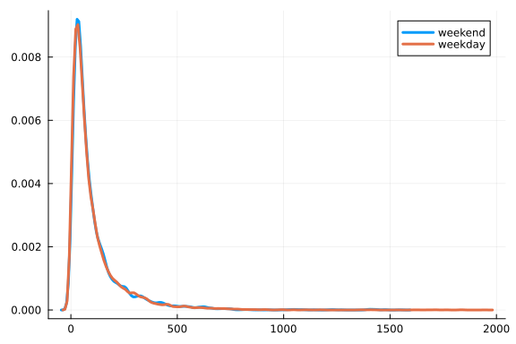

```julia
julia> sp.violin(["duration"], duration_weekday, side=:left, label="weekday")
```
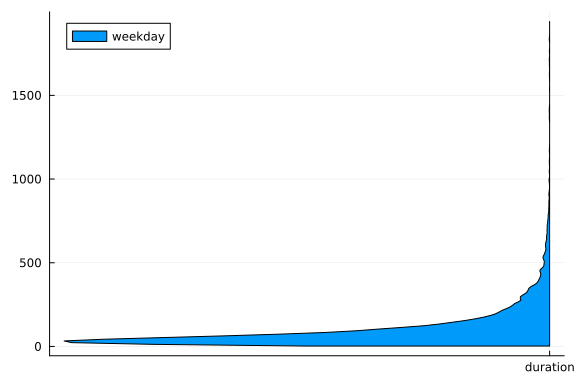

```julia
julia> sp.violin!(["duration"], duration_weekend, side=:right, label="weekend")
```
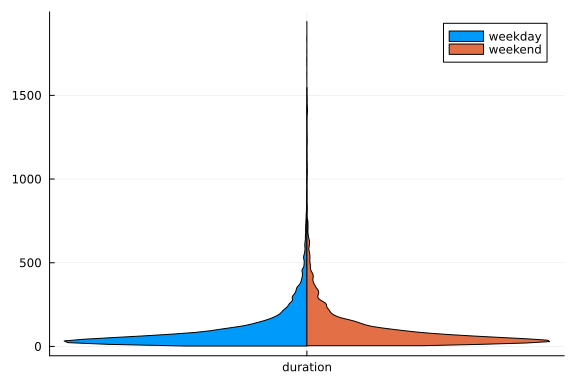

```julia
julia> sp.@df dat3 sp.boxplot(ifelse.(:weekday, "weekday", "weekend"), :duration,
                              notch=true, label=false)
```
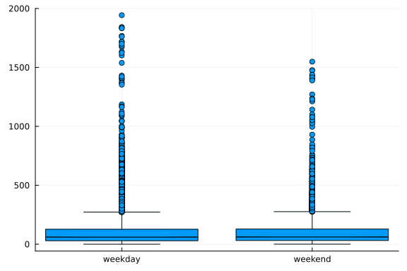

```julia
julia> sp.@df dat3 sp.violin!(ifelse.(:weekday, "weekday", "weekend"), :duration,
                              label=false)
```
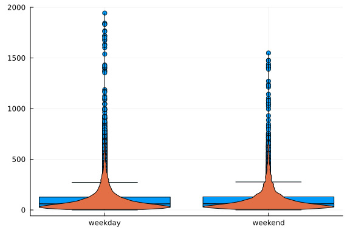

```julia
julia> sp.@df dat3 sp.density(:duration, group=:borough, lw=3)
```
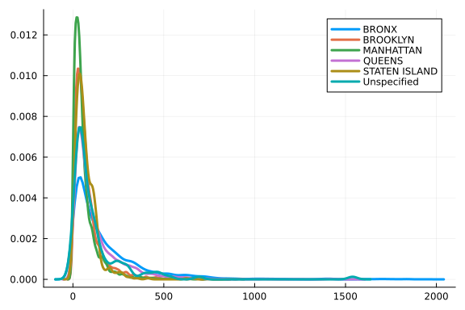

```julia
julia> sp.@df dat3 sp.violin(:borough, :duration, label=false)
```
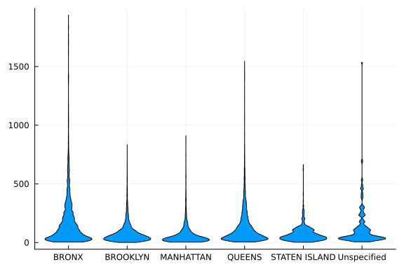

```julia
julia> sp.@df dat3 sp.boxplot(:borough, :duration, label=false)
```
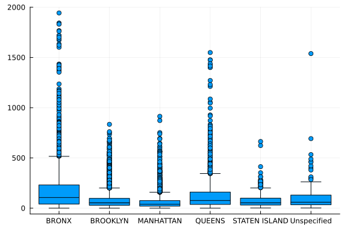


Plot with Makie.jl. Again, you can activate different backends.


Histograms

```julia
julia> g = groupby(dat3, :weekday);

julia> b = combine(g, :duration => Ref);

julia> f = Figure()
```


```julia
julia> for i in 1:2
           ax = Axis(f[1, i], title = "Duration on $(i==1 ? "weekend" : "weekday")")
           hist!(ax, b[i,2], normalization=:probability,
                 bar_labels=:values, label_formatter=x->round(x, digits=3),
                 label_size=15, strokewidth=0.5, strokecolor=(:black, 0.5),
                 color=:values)
           ylims!(ax, 0, 0.8)
       end

julia> f
```
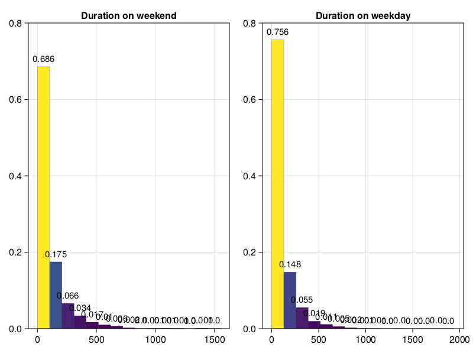


Density plots

```julia
julia> f = Figure()
```


```julia
julia> ax = Axis(f[1, 1], title = "Duration on weekdays and weekends")
Axis with 0 plots:


julia> d1 = density!(duration_weekday, offset=0, strokewidth=2, strokecolor=:black,
                     color=(:red, 0.6))
Combined{Makie.density, Tuple{Vector{Float64}}}

julia> d2 = density!(duration_weekend, strokewidth=2, strokecolor=:black,
                     color=(:green, 0.6))
Combined{Makie.density, Tuple{Vector{Float64}}}

julia> axislegend(ax, [d1, d2], ["weekday", "weekend"], position=:rc)
Legend()

julia> f
```
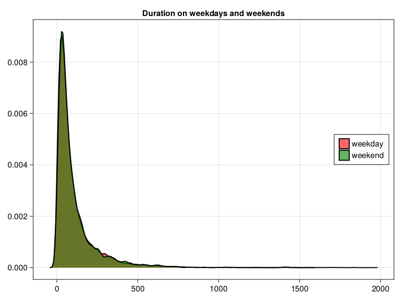


by borough

```julia
julia> g = groupby(dat3, :borough);

julia> b = combine(g, :duration => Ref);

julia> f = Figure()
```


```julia
julia> ax = Axis(f[1, 1])
Axis with 0 plots:


julia> for i in 1:size(b,1)
           density!(ax, b[i,2], strokewidth=2)
       end

julia> f
```
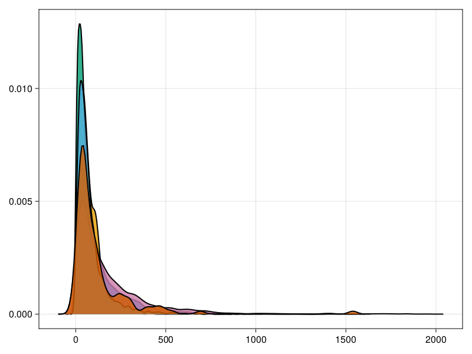


Boxplots

```julia
julia> f = Figure()
```


```julia
julia> ax = Axis(f[1, 1], xticks = (0:1, ["weekend", "weekday"]), 
                 title = "Duration on weekdays and weekends")
Axis with 0 plots:


julia> d = boxplot!(dat3.weekday, dat3.duration, show_notch=true,
                    color=ifelse.(dat3.weekday, :blue, :green), outliercolor=:red)
Combined{Makie.boxplot, Tuple{BitVector, Vector{Float64}}}

julia> f
```
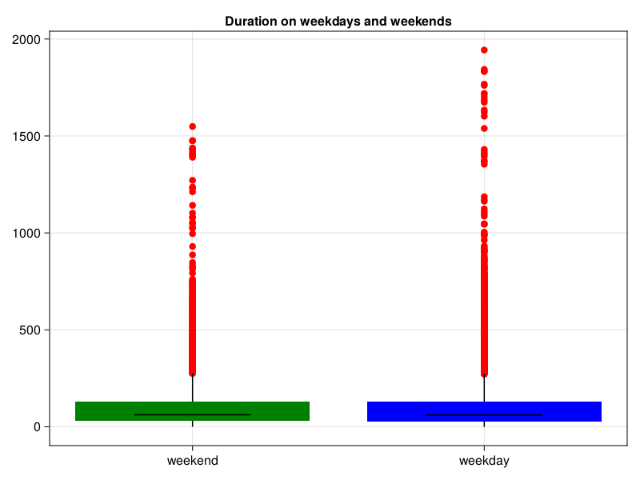


HypothesisTests

```julia
julia> using HypothesisTests

julia> EqualVarianceTTest(duration_weekday, duration_weekend)
Two sample t-test (equal variance)
----------------------------------
Population details:
    parameter of interest:   Mean difference
    value under h_0:         0
    point estimate:          -2.61428
    95% confidence interval: (-6.661, 1.433)

Test summary:
    outcome with 95% confidence: fail to reject h_0
    two-sided p-value:           0.2055

Details:
    number of observations:   [15106,6428]
    t-statistic:              -1.2661004878706232
    degrees of freedom:       21532
    empirical standard error: 2.064827445712


julia> UnequalVarianceTTest(duration_weekday, duration_weekend)
Two sample t-test (unequal variance)
------------------------------------
Population details:
    parameter of interest:   Mean difference
    value under h_0:         0
    point estimate:          -2.61428
    95% confidence interval: (-6.68, 1.451)

Test summary:
    outcome with 95% confidence: fail to reject h_0
    two-sided p-value:           0.2075

Details:
    number of observations:   [15106,6428]
    t-statistic:              -1.2605065048545891
    degrees of freedom:       12006.29661889752
    empirical standard error: 2.0739909126341214


julia> MannWhitneyUTest(duration_weekday, duration_weekend)
Approximate Mann-Whitney U test
-------------------------------
Population details:
    parameter of interest:   Location parameter (pseudomedian)
    value under h_0:         0
    point estimate:          -1.125

Test summary:
    outcome with 95% confidence: reject h_0
    two-sided p-value:           0.0207

Details:
    number of observations in each group: [15106, 6428]
    Mann-Whitney-U statistic:             4.75853e7
    rank sums:                            [1.64354e8, 6.75136e7]
    adjustment for ties:                  239874.0
    normal approximation (μ, σ):          (-965419.0, 4.1744e5)


julia> g = groupby(dat3, :borough);

julia> b = combine(g, :duration => Ref)
6×2 DataFrame
 Row │ borough        duration_Ref
     │ String15       SubArray…
─────┼──────────────────────────────────────────────────
   1 │ QUEENS         [114.05, 66.1167, 76.4833, 89.0,…
   2 │ STATEN ISLAND  [120.567, 75.3833, 68.95, 11.783…
   3 │ MANHATTAN      [60.3167, 40.25, 105.35, 223.75,…
   4 │ BRONX          [157.2, 346.65, 131.75, 164.817,…
   5 │ BROOKLYN       [69.1, 106.75, 14.3667, 107.733,…
   6 │ Unspecified    [34.3833, 115.2, 131.1, 182.917,…

julia> OneWayANOVATest(b.duration_Ref...)
One-way analysis of variance (ANOVA) test
-----------------------------------------
Population details:
    parameter of interest:   Means
    value under h_0:         "all equal"
    point estimate:          NaN

Test summary:
    outcome with 95% confidence: reject h_0
    p-value:                     <1e-99

Details:
    number of observations: [5844, 573, 3826, 3934, 7232, 125]
    F statistic:            390.612
    degrees of freedom:     (5, 21528)


julia> KruskalWallisTest(b.duration_Ref...)
Kruskal-Wallis rank sum test (chi-square approximation)
-------------------------------------------------------
Population details:
    parameter of interest:   Location parameters
    value under h_0:         "all equal"
    point estimate:          NaN

Test summary:
    outcome with 95% confidence: reject h_0
    one-sided p-value:           <1e-99

Details:
    number of observation in each group: [5844, 573, 3826, 3934, 7232, 125]
    χ²-statistic:                        1671.16
    rank sums:                           [7.01507e7, 5.65392e6, 3.12847e7, 5.20025e7, 7.13712e7, 1.40443e6]
    degrees of freedom:                  5
    adjustment for ties:                 1.0

```


- Basic information at the zipcode level such as population density, median
  home value, and median household income is available from the US
  Census. Convenient accesses are, for example, R package `zipcodeR` and
  Python package `uszipcode`; there seems to no Julia equivalent yet but
  Julia can call R or Python easily. Merge the zipcode level information
  with the NYPD requests data.

```julia
julia> dat4 = filter(:latitude => !ismissing, dat3)
21488×15 DataFrame
   Row │ unique_key  created_date         closed_date          agency   compla ⋯
       │ Int64       DateTime             DateTime?            String7  String ⋯
───────┼────────────────────────────────────────────────────────────────────────
     1 │   56524984  2023-01-15T00:00:18  2023-01-15T02:37:30  NYPD     Noise  ⋯
     2 │   56526790  2023-01-15T00:00:21  2023-01-15T01:54:24  NYPD     Noise
     3 │   56525034  2023-01-15T00:00:50  2023-01-15T01:09:56  NYPD     Illega
     4 │   56526234  2023-01-15T00:01:02  2023-01-15T05:47:41  NYPD     Noise
     5 │   56530817  2023-01-15T00:01:07  2023-01-15T01:01:26  NYPD     Noise  ⋯
     6 │   56530491  2023-01-15T00:01:12  2023-01-15T01:47:57  NYPD     Noise
     7 │   56527886  2023-01-15T00:01:22  2023-01-15T00:15:44  NYPD     Blocke
     8 │   56530623  2023-01-15T00:01:23  2023-01-15T01:07:30  NYPD     Illega
   ⋮   │     ⋮                ⋮                    ⋮              ⋮            ⋱
 21482 │   56588474  2023-01-21T23:58:36  2023-01-22T01:02:17  NYPD     Blocke ⋯
 21483 │   56590134  2023-01-21T23:58:43  2023-01-22T01:13:54  NYPD     Noise
 21484 │   56585700  2023-01-21T23:58:48  2023-01-22T01:30:36  NYPD     Noise
 21485 │   56588661  2023-01-21T23:59:10  2023-01-22T02:50:54  NYPD     Noise
 21486 │   56591186  2023-01-21T23:59:12  2023-01-22T06:41:47  NYPD     Illega ⋯
 21487 │   56587053  2023-01-21T23:59:24  2023-01-22T06:24:40  NYPD     Noise
 21488 │   56590382  2023-01-22T00:00:00  2023-01-22T04:29:17  NYPD     Noise
                                               11 columns and 21473 rows omitted
```


PythonCall.jl can be use to interact with Python. You can need to use the following code to install Python packages.

```julia
using CondaPkg
CondaPkg.add_pip("uszipcode")
CondaPkg.add("python-Levenshtein")
```

```julia
julia> uszipcode = pyimport("uszipcode")
Python: <module 'uszipcode' from '/home/ossifragus/Dropbox/work/conference/20231104_DataJamboree/.CondaPkg/env/lib/python3.12/site-packages/uszipcode/__init__.py'>

julia> sr = uszipcode.SearchEngine()
Python: <uszipcode.search.SearchEngine object at 0x7f154e728230>

julia> sr.by_zipcode("10001")
Python: SimpleZipcode(zipcode='10001', zipcode_type='STANDARD', major_city='New York', post_office_city='New York, NY', common_city_list=['New York'], county='New York County', state='NY', lat=40.75, lng=-74.0, timezone='America/New_York', radius_in_miles=0.9090909090909091, area_code_list='718,917,347,646', population=21102, population_density=33959.0, land_area_in_sqmi=0.62, water_area_in_sqmi=0.0, housing_units=12476, occupied_housing_units=11031, median_home_value=650200, median_household_income=81671, bounds_west=-74.008621, bounds_east=-73.984076, bounds_north=40.759731, bounds_south=40.743451)

julia> sr.by_coordinates(40.8636, -73.8704, returns=1)[0]
Python: SimpleZipcode(zipcode='10467', zipcode_type='STANDARD', major_city='Bronx', post_office_city='Bronx, NY', common_city_list=['Bronx'], county='Bronx County', state='NY', lat=40.87, lng=-73.87, timezone='America/New_York', radius_in_miles=2.0, area_code_list='347,718', population=97060, population_density=41649.0, land_area_in_sqmi=2.33, water_area_in_sqmi=0.0, housing_units=37432, occupied_housing_units=35524, median_home_value=369500, median_household_income=36048, bounds_west=-73.89571, bounds_east=-73.855691, bounds_north=40.908016, bounds_south=40.857266)
```


Using a for loop to find one data point a time in Python from julia is slow. I am sure it can be done much faster. A csv file is created to save time. 

```julia
julia> if abspath(PROGRAM_FILE) == @__FILE__ 
           usnames = ("units", "area", "value", "income", "occupiedunits",
                      "population", "population_density", "water_area", "zip")
           dus = length(usnames)
           us = DataFrame([name => Int[] for name in usnames])
           @time for r in eachrow(dat4)#[1:10]
               z = sr.by_coordinates(r.latitude, r.longitude, returns=1)
               if isempty(z)
                   tmp = fill(missing, dus)
               else
                   z = sr.by_coordinates(r.latitude, r.longitude, returns=1)[0]
                   tmp = (z.housing_units, z.land_area_in_sqmi, z.median_home_value,
                          z.median_household_income, z.occupied_housing_units,
                          z.population, z.population_density, z.water_area_in_sqmi,
                          z.zipcode)
                   tmp = pyconvert(Tuple, tmp)
               end
               push!(us, replace(tmp, nothing => missing), promote=true)
           end
           CSV.write("uszipdata.csv", us)
       else
           us = CSV.read("uszipdata.csv", DataFrame)
       end
21488×9 DataFrame
   Row │ units    area        value    income   occupiedunits  population  pop ⋯
       │ Int64?   Float64?    Int64?   Int64?   Int64?         Int64?      Flo ⋯
───────┼────────────────────────────────────────────────────────────────────────
     1 │   37432        2.33   369500    36048          35524       97060      ⋯
     2 │   11854        1.63   427000    60691          11031       36256
     3 │ missing  missing     missing  missing        missing     missing
     4 │   31331        1.48   271300    45864          29855       75784
     5 │   16493        0.18   805300   102941          14622       26121      ⋯
     6 │   31045        1.79   615300    37580          29018       99598
     7 │   37619        2.25   531000    41639          33886       79132
     8 │   30978        2.63   480900    45964          28861      109931
   ⋮   │    ⋮         ⋮          ⋮        ⋮           ⋮            ⋮           ⋱
 21482 │   29074        1.35   551900    34492          25693       67053      ⋯
 21483 │   16724        0.98   464500    40372          15512       49896
 21484 │   16724        0.98   464500    40372          15512       49896
 21485 │   18756        1.52   726500    63739          17033       36934
 21486 │ missing  missing     missing  missing        missing     missing      ⋯
 21487 │   12184        1.07   464500    53617          11194       38615
 21488 │   21127        2.4    454700    52347          19772       50502
                                                3 columns and 21473 rows omitted

julia> dat5 = [dat4[!, Not(:bbl, :incident_address, :incident_zip)] us]
21488×21 DataFrame
   Row │ unique_key  created_date         closed_date          agency   compla ⋯
       │ Int64       DateTime             DateTime?            String7  String ⋯
───────┼────────────────────────────────────────────────────────────────────────
     1 │   56524984  2023-01-15T00:00:18  2023-01-15T02:37:30  NYPD     Noise  ⋯
     2 │   56526790  2023-01-15T00:00:21  2023-01-15T01:54:24  NYPD     Noise
     3 │   56525034  2023-01-15T00:00:50  2023-01-15T01:09:56  NYPD     Illega
     4 │   56526234  2023-01-15T00:01:02  2023-01-15T05:47:41  NYPD     Noise
     5 │   56530817  2023-01-15T00:01:07  2023-01-15T01:01:26  NYPD     Noise  ⋯
     6 │   56530491  2023-01-15T00:01:12  2023-01-15T01:47:57  NYPD     Noise
     7 │   56527886  2023-01-15T00:01:22  2023-01-15T00:15:44  NYPD     Blocke
     8 │   56530623  2023-01-15T00:01:23  2023-01-15T01:07:30  NYPD     Illega
   ⋮   │     ⋮                ⋮                    ⋮              ⋮            ⋱
 21482 │   56588474  2023-01-21T23:58:36  2023-01-22T01:02:17  NYPD     Blocke ⋯
 21483 │   56590134  2023-01-21T23:58:43  2023-01-22T01:13:54  NYPD     Noise
 21484 │   56585700  2023-01-21T23:58:48  2023-01-22T01:30:36  NYPD     Noise
 21485 │   56588661  2023-01-21T23:59:10  2023-01-22T02:50:54  NYPD     Noise
 21486 │   56591186  2023-01-21T23:59:12  2023-01-22T06:41:47  NYPD     Illega ⋯
 21487 │   56587053  2023-01-21T23:59:24  2023-01-22T06:24:40  NYPD     Noise
 21488 │   56590382  2023-01-22T00:00:00  2023-01-22T04:29:17  NYPD     Noise
                                               17 columns and 21473 rows omitted

julia> dropmissing!(dat5)
20877×21 DataFrame
   Row │ unique_key  created_date         closed_date          agency   compla ⋯
       │ Int64       DateTime             DateTime             String7  String ⋯
───────┼────────────────────────────────────────────────────────────────────────
     1 │   56524984  2023-01-15T00:00:18  2023-01-15T02:37:30  NYPD     Noise  ⋯
     2 │   56526790  2023-01-15T00:00:21  2023-01-15T01:54:24  NYPD     Noise
     3 │   56526234  2023-01-15T00:01:02  2023-01-15T05:47:41  NYPD     Noise
     4 │   56530817  2023-01-15T00:01:07  2023-01-15T01:01:26  NYPD     Noise
     5 │   56530491  2023-01-15T00:01:12  2023-01-15T01:47:57  NYPD     Noise  ⋯
     6 │   56527886  2023-01-15T00:01:22  2023-01-15T00:15:44  NYPD     Blocke
     7 │   56530623  2023-01-15T00:01:23  2023-01-15T01:07:30  NYPD     Illega
     8 │   56528076  2023-01-15T00:01:34  2023-01-15T01:49:18  NYPD     Illega
   ⋮   │     ⋮                ⋮                    ⋮              ⋮            ⋱
 20871 │   56584502  2023-01-21T23:58:29  2023-01-22T01:34:56  NYPD     Noise  ⋯
 20872 │   56588474  2023-01-21T23:58:36  2023-01-22T01:02:17  NYPD     Blocke
 20873 │   56590134  2023-01-21T23:58:43  2023-01-22T01:13:54  NYPD     Noise
 20874 │   56585700  2023-01-21T23:58:48  2023-01-22T01:30:36  NYPD     Noise
 20875 │   56588661  2023-01-21T23:59:10  2023-01-22T02:50:54  NYPD     Noise  ⋯
 20876 │   56587053  2023-01-21T23:59:24  2023-01-22T06:24:40  NYPD     Noise
 20877 │   56590382  2023-01-22T00:00:00  2023-01-22T04:29:17  NYPD     Noise
                                               17 columns and 20862 rows omitted
```


+ Data analysis. 
- Define a binary variable `over3h` which is 1 if duration is greater than 3
  hours. Note that it can be obtained even for censored duration.

```julia
julia> dat5.over3h .= dat5.duration .> 180
20877-element BitVector:
 0
 0
 1
 0
 0
 0
 0
 0
 0
 0
 ⋮
 0
 0
 0
 0
 0
 0
 0
 1
 1
```


	- Build a logistic model to predict over3h using the 311 request data as
  well as those zip code level covariates. If your model has tuning
  parameters, justify their choices. Use appropriate metrics to assess the
  performance of the model.

```julia
julia> using GLM, StatsBase

julia> fm = @formula(over3h ~ latitude + longitude + weekday + value + income
                     + population + water_area)
FormulaTerm
Response:
  over3h(unknown)
Predictors:
  latitude(unknown)
  longitude(unknown)
  weekday(unknown)
  value(unknown)
  income(unknown)
  population(unknown)
  water_area(unknown)

julia> lgst = glm(fm, dat5, Bernoulli())
StatsModels.TableRegressionModel{GeneralizedLinearModel{GLM.GlmResp{Vector{Float64}, Bernoulli{Float64}, LogitLink}, GLM.DensePredChol{Float64, LinearAlgebra.CholeskyPivoted{Float64, Matrix{Float64}, Vector{Int64}}}}, Matrix{Float64}}

over3h ~ 1 + latitude + longitude + weekday + value + income + population + water_area

Coefficients:
────────────────────────────────────────────────────────────────────────────────────
                   Coef.    Std. Error       z  Pr(>|z|)     Lower 95%     Upper 95%
────────────────────────────────────────────────────────────────────────────────────
(Intercept)   0.0         NaN           NaN       NaN     NaN           NaN
latitude      4.3594        0.224315     19.43    <1e-83    3.91975       4.79905
longitude     2.4171        0.124224     19.46    <1e-83    2.17362       2.66057
weekday       0.0374286     0.0417289     0.90    0.3697   -0.0443586     0.119216
value        -1.38242e-6    1.61184e-7   -8.58    <1e-17   -1.69833e-6   -1.0665e-6
income       -9.57878e-7    1.30116e-6   -0.74    0.4616   -3.50811e-6    1.59235e-6
population    1.66498e-6    8.59956e-7    1.94    0.0529   -2.0506e-8     3.35046e-6
water_area    0.792161      0.271544      2.92    0.0035    0.259944      1.32438
────────────────────────────────────────────────────────────────────────────────────

julia> p̂ = GLM.predict(lgst)
20877-element Vector{Float64}:
 0.31111966003556635
 0.16506222680628777
 0.3073776454912984
 0.10351388965583477
 0.07661270152179683
 0.08760770837939703
 0.19414361757765922
 0.06187367866992861
 0.19483019897093143
 0.08697028138265056
 ⋮
 0.10352303880619618
 0.08874324033414721
 0.110739417202061
 0.12481075944915418
 0.14281041685941756
 0.13956883926825323
 0.10419732204978788
 0.1803144647442237
 0.27307904394615135

julia> mean((p̂ .> 0.5) .== dat5.over3h) # accuracy
0.8344589739905158

julia> function cal_auc(p, y)
           p1, p0 = p[y .== 1], p[y .== 0]
           n1, n0 = length(p1), length(p0)
           s = 0.0
           for i in p0, j in p1
               s += (i < j) + 0.5(i == j)
           end
           s / (n1*n0)
       end
cal_auc (generic function with 1 method)

julia> @time cal_auc(p̂, dat5.over3h)
  0.220555 seconds (221.89 k allocations: 15.309 MiB)
0.6663342965439752

julia> using FLoops

julia> function cal_aucF(p, y)
           p1, p0 = p[y .== 1], p[y .== 0]
           n1, n0 = length(p1), length(p0)
           @floop for i in p0, j in p1
               @reduce(s += (i < j) + 0.5(i == j))
           end
           s / (n1*n0)
       end
cal_aucF (generic function with 1 method)

julia> @time cal_auc(p̂, dat5.over3h)
  0.066229 seconds (11 allocations: 177.047 KiB)
0.6663342965439752

julia> @time cal_aucF(p̂, dat5.over3h)
  0.560019 seconds (644.01 k allocations: 43.124 MiB, 13.51% gc time, 16.31% compilation time)
0.6663342965439752

julia> using MLJ

julia> accuracy(p̂ .> 0.5, dat5.over3h)
0.8344589739905159

julia> y_cat = categorical(dat5.over3h);

julia> c = categorical(unique(y_cat))
2-element CategoricalArrays.CategoricalArray{Bool,1,UInt32}:
 false
 true

julia> ŷ = [UnivariateFinite(c, [1.0 - p, p]) for p in p̂];

julia> @time auc(ŷ, y_cat)
  0.012087 seconds (11 allocations: 652.750 KiB)
0.6663342965439752

julia> rc = roc_curve(ŷ, y_cat);

julia> plt.plot(rc[1:2]..., color=:red, lw=3, label="glm", legend=:right,
                xlab="False Positive", ylab="True Positive")
```
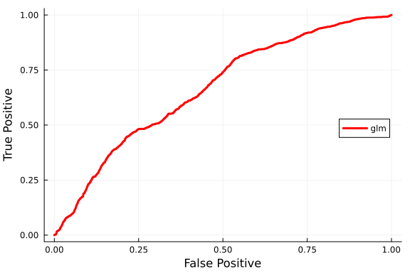


- Repeat the analysis with another model (e.g., random forest; neural
  network; etc.).


```julia
julia> using XGBoost

julia> X = dat5[!,[:latitude, :longitude, :weekday, :value, :income, :population, :water_area]]
20877×7 DataFrame
   Row │ latitude  longitude  weekday  value   income  population  water_area
       │ Float64   Float64    Bool     Int64   Int64   Int64       Float64
───────┼──────────────────────────────────────────────────────────────────────
     1 │  40.8636   -73.8704    false  369500   36048       97060        0.0
     2 │  40.7028   -73.8376    false  427000   60691       36256        0.0
     3 │  40.8324   -73.8589    false  271300   45864       75784        0.0
     4 │  40.7737   -73.9478    false  805300  102941       26121        0.0
     5 │  40.6353   -74.0202    false  615300   37580       99598        0.0
     6 │  40.5811   -73.9569    false  531000   41639       79132        0.19
     7 │  40.7381   -73.8583    false  480900   45964      109931        0.04
     8 │  40.6243   -74.008     false  681700   61893       41788        0.0
   ⋮   │    ⋮          ⋮         ⋮       ⋮       ⋮         ⋮           ⋮
 20871 │  40.6383   -73.9453    false  426100   48400       76174        0.0
 20872 │  40.6887   -73.9076    false  551900   34492       67053        0.0
 20873 │  40.7054   -73.9157    false  464500   40372       49896        0.02
 20874 │  40.7068   -73.9292    false  464500   40372       49896        0.02
 20875 │  40.7225   -73.9468    false  726500   63739       36934        0.08
 20876 │  40.7576   -73.8753    false  464500   53617       38615        0.0
 20877 │  40.8464   -73.8283    false  454700   52347       50502        0.0
                                                            20862 rows omitted

julia> Y = dat5.over3h
20877-element BitVector:
 0
 0
 1
 0
 0
 0
 0
 0
 0
 0
 ⋮
 0
 0
 0
 0
 0
 0
 0
 1
 1

julia> bst = xgboost((X,Y), num_round=100, max_depth=10, objective="binary:logistic")
Booster()

julia> p̂_xgb = XGBoost.predict(bst, X)
20877-element Vector{Float32}:
 0.02964254
 0.14859171
 0.7987125
 0.026607411
 0.017226843
 0.025675919
 0.1849252
 0.0009443293
 0.05393643
 0.0038877402
 ⋮
 0.026607411
 0.00012181072
 0.00266249
 0.15025197
 0.15114085
 0.009047651
 0.17287524
 0.6756687
 0.5761649

julia> accuracy(p̂_xgb .> 0.5, y_cat)
0.9007041241557695

julia> cal_auc(p̂_xgb, Y)
0.9478532936116905

julia> ŷ_xgb = [UnivariateFinite(c, [1.0 - p, p]) for p in p̂_xgb];

julia> rc_xgb = roc_curve(ŷ_xgb, y_cat)
([0.0, 0.0, 0.0, 0.0, 0.0, 0.0, 0.0, 0.0, 0.0, 0.0  …  0.9991963721944779, 0.9992537741805867, 0.9994833821250215, 0.9995981860972389, 0.9996555880833476, 0.9997129900694564, 0.9998277940416739, 0.9998851960277826, 0.9999425980138913, 1.0], [0.0, 0.00028935185185185184, 0.002025462962962963, 0.0023148148148148147, 0.00318287037037037, 0.004050925925925926, 0.004629629629629629, 0.004918981481481482, 0.005208333333333333, 0.005497685185185185  …  1.0, 1.0, 1.0, 1.0, 1.0, 1.0, 1.0, 1.0, 1.0, 1.0], [0.9785438179969788, 0.9648628234863281, 0.9570191502571106, 0.948989748954773, 0.9487460851669312, 0.9475162625312805, 0.9425473213195801, 0.9362542629241943, 0.9339721202850342, 0.929896354675293  …  0.00013061388744972646, 0.00012431186041794717, 0.00012181072088424116, 0.00011837841157102957, 0.00011661482130875811, 0.00010541961819399148, 9.845692693488672e-5, 9.515414421912283e-5, 8.833550964482129e-5, 8.078639802988619e-5])

julia> plt.plot!(rc_xgb[1:2]..., color=:blue, lw=3, label="xgboost")
```


